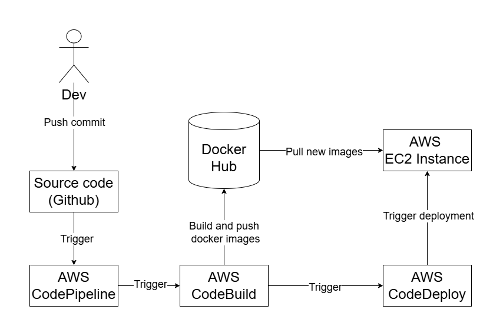

# Introduction

A fully functional E-Commerce Website built with NextJS, Echo and MySQL.

## Deployment



## Installation

### Front-end: install the node package manager [npm](https://www.npmjs.com/) and run the command below.

```bash
npm run dev
```

### Back-end: install [go](https://go.dev/) and run the command below.

```bash
go run .
```
